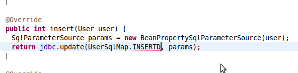

## MyBatis 대비 Spring JDBC의 장점
아래와 같은 이유로 Spring JDBC는 MyBatis와 비교해서 학습 비용은 낮고 생산성은 높습니다.

- 초기 설정이 단순합니다.
- 쿼리 결과를 변환하는 구성요소(`RowMapper`)가 인터페이스로 정의되어 Java 컴파일러의 장점을 활용할 수 있습니다.
- SQL 쿼리를 Groovy 파일 안에 선언하면 Java 컴파일러의 장점을 활용할 수 있습니다.
- 간단한 ORMapping 기능을 제공합니다.
- Collection 파라미터를 더 편하게 사용할 수 있습니다.
- MyBatis의 일부 기능들은 단순히 쿼리를 실행하기만을 원하는 사람에게는 불필요하고 디버깅을 어렵게 합니다.
	- 세션관리, batch update 추상화 등


### 초기 설정
Spring JDBC의 `NamedParameterJdbcTemplate`은 `DataSource` 객체만 미리 정의되어 있다면 코드 1줄로 생성할 수 있습니다.

```java
NamedParameterJdbcOperations jdbc = new NamedParameterJdbcTemplate(dataSource);
```

`DataSource`만 외부에서 주입받아서 DAO 클래스나 공통 상위클래스에서 직접 `NamedParameterJdbcTemplate`를 생성해서 사용을 해도 됩니다. `DataSource` 선언은 어느 프레임워크를 쓰더라도 필요한 부분입니다. 따라서 Spring JDBC만을 위한 설정에 드는 시간은 거의 없습니다.

MyBatis를 쓴다면 `SqlSessionFactory`, `SqlSessionTemplate`, 매퍼XML 혹은 매퍼 인터페이스와 같은 더 많은 구성요소가 중간에 들어갑니다. 초기 설정을 하기 위해서는 그런 구성요소의 개념과 역할을 이해해야 합니다.

### 쿼리 결과 변환 인터페이스
Spring JDBC의 `RowMapper`라는 인터페이스는 JDBC의 `ResultSet`에서 원하는 자바 객체로 변환하는 역할을 합니다. 기본적으로 제공되는 `RowMapper`의 구현체로는 객체의 setter를 활용하는 `BeanPropertyRowMapper`, `java.util.Map`으로 변환하는 `ColumnMapRowMapper`가 있습니다. 컬럼명과 객체의 속성명을 직접 지정해 줄수 밖에 없을 때에는 `RowMapper` 인터페이스를 직접 구현합니다. 예를 들면 DB의 컬럼은 'desc'인데 Java객체에서는 'description'으로 매핑하고 싶을 때 같은 경우입니다.

`RowMapper`를 구현할 때는 당연히 setter나 생성자 호출 같은 Java 문법을 그대로 활용하면 됩니다. `RowMapper`는 메서드가 하나인 인터페이스이기 때문에 람다표현식과 메서드 레퍼런스를 활용할 수도 있습니다. 아래 코드는 `seller`라는 속성을 포함한 `Product` 클래스에 대한 매핑 로직을 람다 표현식으로 작성한 예제입니다.

```java
public class Product {
	private Integer id;
	private Integer name;
	private String description;
	private Seller seller;
	// getter, setter 생략
...

}
```

```java
RowMapper<Product>  productMapper = (rs, rowNum) -> {
	Product product = new Product();
	product.setId(rs.getInt("id"));
	product.setName(rs.getString("name"));
	product.setDescription(rs.getString("desc"));

	Seller seller = new User(
		rs.getInt("sell_id"),
		rs.getString("sell_name")
	);
	product.setSeller(seller);

	return product;
};
```


MyBatis에서는 아래와 같이 XML로 쿼리의 결과를 매핑하는 선언을 할 수 있습니다.

```xml
<resultMap id="projectResultMap" type="example.Product">
	<result property="id" column="id" />
	<result property="name" column="name"/>
	<result property="price" column="price"/>
	<result property="description" column="desc"/>
	<association property="seller" javaType="example.Seller">
		<constructor>
			<idArg column="seller_id" javaType="int"/>
			<arg column="seller_name" javaType="String"/>
		</constructor>
	</association>
</resultMap>
```

위와 같은 XML형식에서는 `property="id"`와 같은 부분에 오타가 있어도 어플리케이션은 빌드, 배포될 수 있습니다. 그런 오류는 프레임워크가 실행되는 되는 시점에 확인되기 때문입니다. 반면 `RowMapper`의 구현 예제에서 `setId()`, `setName()`과 같은 메서드들은 오타를 친다면 아예 컴파일이 되지 않습니다. 속성명 중 일부만 입력해도 자동완성을 할 수 있습니다.

`RowMapper`를 직접 구현하면 적극적인 타입변환을 간편하게 할 수도 있습니다. 날짜 변환이나 Enum, Java8의 `Optional`과 같은 클래스를 쓰기에도 좋습니다. 예를 들면 DB에는 'reg_time'이라는 컬럼이 VARCHAR(14)의 형식으로 '20150101120000'처럼 저장되어 있을 때 Java 객체는 LocalDateTime으로 쓰고 싶다고 합시다. 이 때 `RowMapper`안에서 바로 `LocalDateTime.parse()` 메서드를 호출하면 그런 작업은 간단히 끝납니다.

```java
private final DateTimeFormatter formatter = DateTimeFormatter.ofPattern("yyyyMMddHHmmss"); // DB에 문자열로 들어간 날짜 데이터 변환에 사용

RowMapper<Product>  productMapper = (rs, rowNum) -> {
	Product product = new Product();
	...
	LocalDateTime regTime = LocalDateTime.parse(rs.getString("reg_time"), formatter);
	product.setRegisteredTime(regTime);
	return product;
};

```

MyBatis/iBatis를 타입의 변환은 DAO의 코드에서 하거나 별도의 [TypeHandler]http://www.mybatis.org/mybatis-3/ko/configuration.html#typeHandlers)를 작성해야 합니다. Spring JDBC에서도 [Converter](http://docs.spring.io/spring/docs/current/javadoc-api/org/springframework/core/convert/converter/Converter.html)를 구현해서 별도의 클래스로 변환 로직을 뺄 수도 있습니다. 하지만 1회성 작업이라면 직접 `RowMapper`안에서 구현할 수도 있으므로 MyBatis에 비해서 더 편리합니다.

일반화하면 XML선언과 비교해서 Java 코드의 장점은 아래와 같습니다.

- 별도의 태그를 학습할 필요가 없음
- IDE 기능을 활용할 수 있는 범위가 넓어짐
	- 코드 추적, 자동 완성, 오타 표시, 리팩토링
- 빌드툴에 의한 검증
	- 변수명, 메소드 등에 오타가 있으면 아예 배포될 수 없음.
- 구조화, 기능 확장에 용이
- 테스트 코드 커버리지를 측정 가능
- 성능에 유리
	- 별도의 XML 파싱비용이 없음.
	- 컴파일러의 최적화 대상이 됨.

Spring JDBC의 `RowMapper`는 인터페이스 기반이기에 MyBatis의 `<resultMap/>`과 대비하면 위와 같은 장점을 누릴 수 있습니다.

MyBatis에서는 애너테이션으로 쿼리 결과를 매핑하는 방법도 있습니다.

```java
	@Select(SELECT_PRODUCT)
	@Results(value = {
		@Result(property="id", column="id"),
		@Result(property="name", column="name"),
		@Result(property="price", column="price")
		@Result(property="seller.id", column="seller_id")
		@Result(property="seller.name", column="seller_name")
        })

```

하지만 직접 getter나 생성자를 호출하는 것보다는 컴파일러의 장점을 활용하지 못합니다. `property="id"`와 같은 애노테이션의 속성값에 오타가 있어도 컴파일러는 에러를 내지 않고, 이름을 바꾸는 리팩토링을 할 때도 주의를 기울여야 합니다.


### SQL 선언
Spring JDBC에서는 실행할 SQL을 String 타입으로 받습니다. SQL을 주로 XML안에 선언하는 MyBatis에 익숙한 분들은 이 점을 가장 Spring JDBC의 단점으로 여깁니다. 그러나 응용을 한다면 Spring JDBC에서는 MyBatis보다 편리한 방법으로 SQL을 관리할 수 있습니다.

SQL을 Groovy의 Multiline String으로 선언하는 방법을 가장 권장합니다. Groovy로 만든 클래스는 Java 클래스와 동일한 방식으로 참조됩니다. 그 때문에 쿼리를 저장한 변수 이름을 IDE에서 자동 완성하고 코드를 추적하기에도 좋습니다. 추가적인 학습 비용도 없습니다. Groovy의 클래스, 변수 선언 방식을 Java와 동일한 방식으로 할  수 있습니다. `"""`을 쓰면 여러 줄로 문자열을 선언할 수 있다는 것 1가지만 알면 됩니다. 아래의 Groovy 코드를 보면 멀티라인 스트링을 제외하고는 기존 Java 문법과 동일한 것을 알 수 있습니다.

```groovy
class SellerSqls {
	public static final String SELECT = """
		SELECT name, address
		FROM seller
		WHERE name = :name
	""";
}
```
`NamedParameterJdbcTemplate`을 호출할때 아래와 같이 String 상수를 참조하는 방식으로 SQL을 전달할 수 있습니다. `static final`로 선언된 상수이므로 컴파일 타임에 최적화될 가능성이 높다는 것도 장점입니다.

```java
public List<Seller> findByName(String name) {
	SqlParameterSource params = new MapSqlParameterSource("name", name);
	return jdbc.query(IssueSqls.SELECT_BY_ONWER_AND_NAME, params, sellerMapper);
}
```

같이 쿼리를 저장한 변수명을 잘 못 입력했을 경우 아래와 같이 IDE 안에서 바로 알려줍니다.



Dynamic SQL을 생성할 때도 Java의 조건/반복문과 다른 유틸리티 메서드 호출을 자연스럽게 쓸 수 있습니다.

```groovy
public static String buildSelectSql(Seller seller) {
	StringBuilder sql = new StringBuilder();
	sql.append("""
		SELECT name, address
		FROM seller
		WHERE 1=1
	""");

	isNotEmpty(seller.getName(), sql, """
		AND  name = :name
	""");

	isNotEmpty(seller.getAddress(), sql, """
		AND  address = :address
	""");

	return sql.toString();
}

private static void isNotEmpty(String param, StringBuilder sql, String part) {
	if(StringUtils.isNotEmpty(param)) {
		sql.append(part);
	}
}
```

자주 사용 될법한 `isNotEmpty()` 같은 메서드는 별도의 유틸리티 클래스로 빼고 static import 를 도입하는 등 추가적인 리팩토링 하기에도 좋습니다. 테스트 코드를 짠 후 Emma와 같은 코드커버리지 측정 도구를 사용할 수도 있습니다.

Maven, Eclipse등에서 Groovy를 쓰기 위해 필요한 설정은 [Groovy 설정 방법](./groovy-config.md)을 참조하시기 바랍니다. Plugin을 설정, 설치해야하는 것이 MyBatis를 쓸 때와 비교하면 추가되는 비용이라고 생각하실 수도 있습니다. 하지만 `pom.xml`이나 `builde.gradle`에 groovy plugin을 추가하는 작업은 MyBatis를 쓰기 위한 설정을 하는 것과 비교하면 간단한 일입니다. Eclipse에서는 Groovy plugin을 각 개발자가 PC에 설치해야하는 추가 작업이 필요하기는 합니다. 그러나 Eclipse plugin 설치는 다운로드 받는 시간이 오래 걸릴 뿐 손이 많이 각는 작업은 아닙니다. IntelliJ IDEA Ultimate Edition에서는 Groovy plugin이 기본적으로 설치되어 있습니다.

#### MyBatis의 XML 선언과의 비교
MyBatis의 XML로는 비슷한 선언을 아래와 같이 해야합니다.


```xml
<select id="findSeller" resultType="Seller">
    <include refid="example.functions.isNotEmpty" />
	SELECT name, address
	FROM seller
	WHERE 1=1
  <if test="#fn = isBlank, #fn(name)">
    AND name = #{name}
  </if>
  <if test="#fn = isBlank, #fn(address)">
    AND address = #{address}
  </if>
</select>

...
<mapper namespace="example.functions">
	<sql id="isBlank">
		<bind name="isNotEmpty" value=":[@org.apache.commons.lang3.StringUtils@isNotEmpty(#this)]" />
	</sql>
</mapper>
```

여러 XML 태그의 사용법을 익혀야합니다. 오타가 뒤늦게 발견될 가능성도 높고, 코드를 추적하거나 리팩토링을 할 때도 IDE에서 할 수 있는 영역이 줄어듭니다. 자동 완성 되는 범위가 좁기에 유사한 코드를 복사해서 붙여넣기를 하는 경우가 많습니다. 붙여넣기한 코드를 미처 다 수정하지 않아서 생기는 오류도 많을 것입니다.

물론 MyBatis에서도 아래와 같은 IDE plugin을 이용하면 자동완성과 오류 검증에 도움을 받을 수 있습니다.

- (Eclipse) [MyBatipse](https://marketplace.eclipse.org/content/mybatipse)
- (Eclipse) [mybatiseditor](https://marketplace.eclipse.org/content/mybatiseditor)
- (IntelliJ) [MyBatis plugin for IntelliJ IDEA](https://plugins.jetbrains.com/idea/plugin/7293-mybatis-plugin)
강점이 있습니다.

그렇지만 자바 컴파일러가 하는 검증은 Maven과 같은 빌드툴에 의한 빌드, IDE 등 여러 단계에서 동작한다는 장점이 더 있습니다. 예를 들면 IDE 밖에서 소스 충돌을 해결하면서 실수를 남긴 경우에도 컴파일 타임에 오류가 난다면 그런 코드가 배포되지 않도록 막을 수 있습니다.


#### MyBatis의 애너테이션 사용법과의 비교
이전에는 iBatis/MyBatis가 SQL파일을 XML에 선언하는 것을 강제할 수 있다는 점에서 선호되는 경향도 있었습니다. 그러나 최근의 MyBatis에서는 Java파일 안에 SQL을 넣는 기능이 더 들어가서 그런 강제화의 효과는 없습니다. MyBatis에서는 아래와 같이 애너테이션으로 쿼리를 지정할 수 있습니다.

```java
	@Select("SELECT id, name, address FROM seller WHERE id = #{id}")
	Seller findById(Integer id)
```

Spring JDBC와 마찬가지로 Java 코드 안에서 SQL을 관리해야하는 과제가 생깁니다.

동적쿼리를 생성하기 위한 `org.apache.ibatis.jdbc.SQL` 클래스도 제공됩니다.

```java
class SellerSqlBuilder {
	public String selectSeller(Seller seller) {
		return new SQL() {{
			SELECT("name, address");
			FROM("seller");
			if (StringUtils.isNotEmpty(seller.getName())) {
				WHERE("name = #{name}");
			}
			if (StringUtils.isNotEmpty(seller.getAddress())) {
				WHERE("address = #{address}");
			}
		}}.toString();
	}
}
```

`@SelectProvider`라는 선언을 통해 SQL을 생성하는 메서드를 참조합니다.

```
	@SelectProvider(type = SellerSqlBuilder.class, method = "selectSeller")
	List<Seller> findSeller(Seller seller);

```

위의 `selectSeller` 같은 부분은 문자열이므로, 메서드 이름을 바꾸는 리팩토링을 할때 자동으로 반영되지 않는다는 단점이 있습니다.


정리하면, MyBatis에서 애너테이션 방식으로 쿼리를 쓴다고해도 Spring JDBC대비 장점은 보이지 않습니다.

#### 활용법의 상호 응용
MyBatis에서도 Java코드에 SQL을 선언할수 있게 됨에 따라 Spring JDBC와 MyBatis의 쿼리 관리 기법들은 상호 응용이 가능합니다. 예를 들어보겠습니다.

첫번째, MyBatis에서도 Groovy의 멀티라인 스트링을 이용하는 것입니다. Groovy 클래스 안에 `public static final`로 선언된 SQL은 애너테이션 안에서도 참고가 가능합니다. SQL 선언은 Groovy로 된 상수 클래스에 모으고 아래와 같이 `@Select`와 같은 애너테이션에서는 상수를 참조하도록 선언할 수 있습니다.

```java
	@Select(SellerSqls.SELECT_BY_ID)
	Seller findById(Integer id)
```

두번째, MyBatis의 Sql builder를 Spring JDBC에서 활용하는 것입니다. 앞선 예제의 `SellerSqlBuilder.selectSeller()` 직접 호출한 후 SQL이 단긴 String을 `NamedParameterJdbcTemplate`에 파라미터로 넘길수도 있습니다.

SQL 쿼리 관리에 대한 더 다양하고 자세한 내용은 [SQL 관리방법](sql-management.md)을 참조하시기 바랍니다.


### 간단한 ORMapping 기능
Spring JDBC와 이를 확장한 라이브러리를 이용하면 간단한 수준으로 ORM의 기능을 쓸 수도 있습니다.

- Create 쿼리 자동생성 : `SimpleJdbcInsert`
- Update 쿼리 자동생성 : `SimpleJdbcUpdate` (확장 라이브러리)
- 1:다 관계를 1개의 쿼리로 조회하는 경우 객체 매핑 : `OneToManyResultSetExtractor` (확장 라이브러리)

위의 정도로도 충분히 생산성에 도움이 됩니다 `SimpleJdbcInsert`, `SimpleJdbcUpdate`를 이용하면 'CRUD' 중 'CU'(Create, Update)에 대한 쿼리를 직접 작성할 필요가 없습니다. 'D'(Delete)는 어짜피 쿼리가 단순해서 큰 부담이 되지 않습니다. 'R'(READ) 중 여러 건을 조화하는 쿼리는 ORM을 쓰더라도 직접 SQL과 비슷한 추상화수준으로 기술해주어야하는 경우가 많습니다. Native SQL을 쓸때는 Spring JDBC쪽이 더 편리한 면도 있습니다.

나름대로의 관계 매핑 전략도 수립할 수 있습니다. 예를 들면 1대1, 다대1 관계는 RowMapper안에서 직접 직접해주고 1대다 관계에는 `OneToManyResultSetExtractor`를 이용하는 식입니다. 지연로딩은 람다표현식을 이용해서 수동으로 할 수도 있습니다. 보다 자세한 내용은 아래 링크를 참조하시기 바랍니다.

- [Spring JDBC 핵심 사용법](spring-jdbc-core.md) 중 SimpleJdbcInsert 단락
- [Spring JDBC 확장 라이브러리](spring-jdbc-extensions.md) : `SimpleJdbcUpdate`와 `OneToManyResultSetExtractor`에 대한 소개
- [연관관계 지연로딩 기법](lazy-loading.md)

본격 ORM에 비하면 빈약한 기능이지만 더 단순하고 명확하다는 장점도 있습니다. 어플리케이션의 특성과 개발자들의 성향에 따라서는 Spring-JDBC가 더 생산성이 높은 경우도 있을 것입니다.

### 단순한 Collection 파라미터 매핑
하나의 파라미터로 여러개의 값을 넘길 때에는 `java.util.List` 값으로 넣으면 됩니다. `IN` 절에서 여러개의 파라미터를 받는 코드를 예로 들겠습니다. MyBatis를 쓸때는 아래와 같이 XML 안에서 foreach태그로 반복문을 써줘야합니다. XML 태그로 제어문 프로그래밍을 하는 격입니다.

```xml
<select id="seletSellerIn" resultType="domain.Seller">
	SELECT id, name, tel_no, address, homepage
	FROM seller
	WHERE id IN
  <foreach item="id" index="index" collection="idList" open="(" separator="," close=")">
     #{item}
  </foreach>
</select>
```

Spring JDBC의 `NamedParameterJdbcTemplate`에서 참조할 쿼리라면 아래와 같이 옮길 수 있습니다.

```groovy
public static final String SELECT_SELLER_IN = """
		SELECT id, name, tel_no, address, homepage
		FROM seller
		WHERE id IN (:idList)
""";
```

`<foreach/>`선언 같은 것을 없이  `Collection` 타입을 바로 파라미터로 받을 수 있습니다.

### MyBatis의 Session 관리
MyBatis의 `SqlSession`은 단순한 쿼리 실행기 이상의 역할을 합니다. 세션의 생명주기 내에서 추상화된 레이어를 제공해서 나름대로의 최적화를 합니다. 예를 들면 `SqlSession`의 생명 주기 내에서 같은 쿼리가 같은 파라미터로 조회 요청이 오면 실제로는 쿼리를 날리지 않고 캐쉬된 값을 반환합니다. `ExecutorType.BATCH` 모드로 `SqlSession`이 열리게 되면 INSERT, UPDATE, DELETE 구문은 바로 실행되지 않고 다음에 SELECT문이 들어오면 JDBC의 batchUpdate로 실행하게 됩니다.

이런 특성을 잘 활용해서 성능을 개선할수도 있는 장점이 있을수도 있습니다. 그러나 단순히 쿼리를 실행하는 프레임워크를 기대한 사람에게는 이런 특성이 부담이 될 수도 있습니다. 경우에 따라서 언제 쿼리가 날아갈지 예측을 해야하기 때문입니다.

Spring JDBC는 단순히 쿼리만 실행하기를 원하는 사람의 기대에 맞게 동작합니다. batchUpdate같은 동작도 의도적으로 구분해서 실행을 할 수 있습니다. 세션 관리 등 JDBC를 더 추상화한 API를 원하는 사람에게는 JPA가 더 풍부한 기능을 제공합니다. MyBatis는 그 중간이라서 표지셔닝이 모호합니다.

## 더 발전한 프레임워크를 찾는다면

### SQL 구문을 쓰면서 컴파일러와 IDE의 장점을 이용하고 싶다면?
Spring JDBC에서 컴파일타임에 검증되는 부분이 많은 점이 마음에 들었다면 그 특징을 더 강화한 프레임워크를 검토해볼만합니다. [Querydsl Sql](https://github.com/querydsl/querydsl/tree/master/querydsl-sql)과
[JOOQ](http://www.jooq.org/)는 SQL의 선언도 Java의 타입을 살린 코드로 작성하는 프레임워크입니다. 그래서 Spring JDBC에서는 문자열일 뿐이였던 SQL을 작성할 때도 오타를 더 많이 검증하고 자동 완성을 활용할 수 있습니다.

### 객체매핑 로직을 더 추상화하고 싶다면?
Spring JDBC는 JDBC를 단순하고 편리하게 쓰는 것에 초점을 맞춘 프레임워크이기에 풍부한 객체 매핑 기능을 제공하지는 않습니다. 본격적인 ORM을 사용해보고 싶다면 JPA 스펙과 Hibernate, [Spring Data JPA](http://projects.spring.io/spring-data-jpa/)에 관심을 가질만합니다.

경험으로는 ORM을 도입한다고 해서 초기 생산성이 바로 올라가지는 않습니다. MyBatis에 비해서도 초기에 알아야 지식이 많습니다. 어떤 전략을 써서 객체를 매핑할지에 대해서는 오히려 더 많은 고민이 생깁니다. 단순히 쿼리 생성을 자동화해서 생산성을 올리겠다는 기대만으로 ORM을 도입한다면 어긋날 가능성이 높습니다.

ORM을 경험해보지 못했다면 앞에서 소개한 Spring JDBC의 간단한 ORM 기능을 먼저 사용해보시기를 추천드립니다. 그 과정에서 INSERT 쿼리가 자동 생성되는 것이나 테이블간의 관계를 살린 객체의 장점 정도는 느낄 수 있습니다. DB와 대응되는 객체를 어떻게 설계할지에 대한 노하우를 쌓을 수도 있습니다. 프로젝트의 상황이나 구성원의 성향에 따라서는 그 정도로도 충분히 만족스러울 수도 있습니다. Spring JDBC에서 자동으로 해주는 부분이 많지 않아서 아쉽다면 ORM의 필요성이 느껴진 것입니다. 그럴 때 점진적으로 JPA 같은 ORM을 도입할 수도 있습니다.
