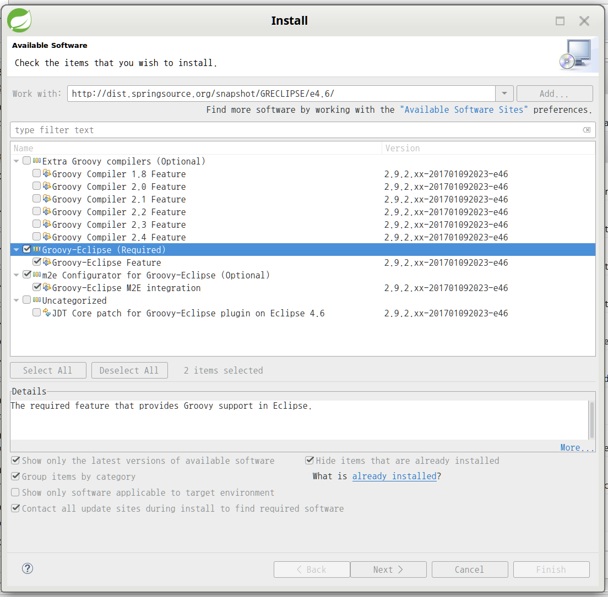
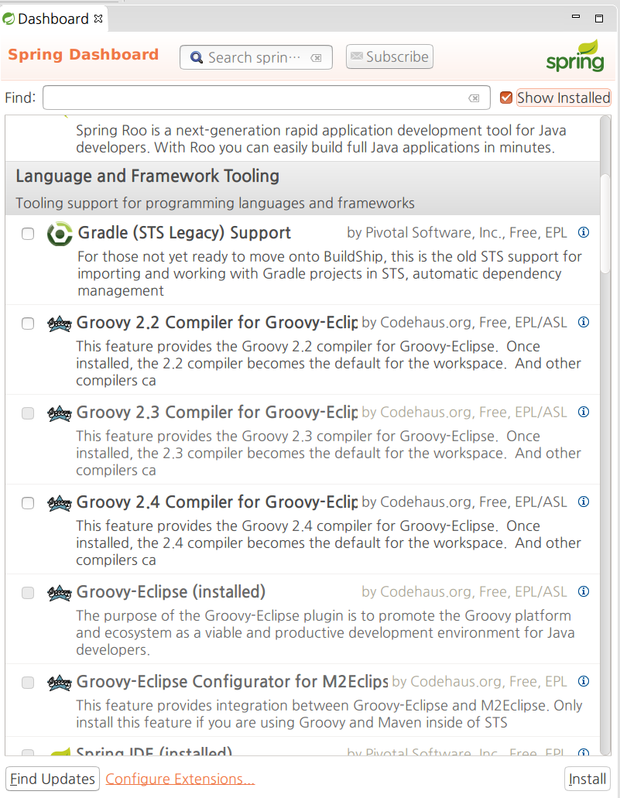
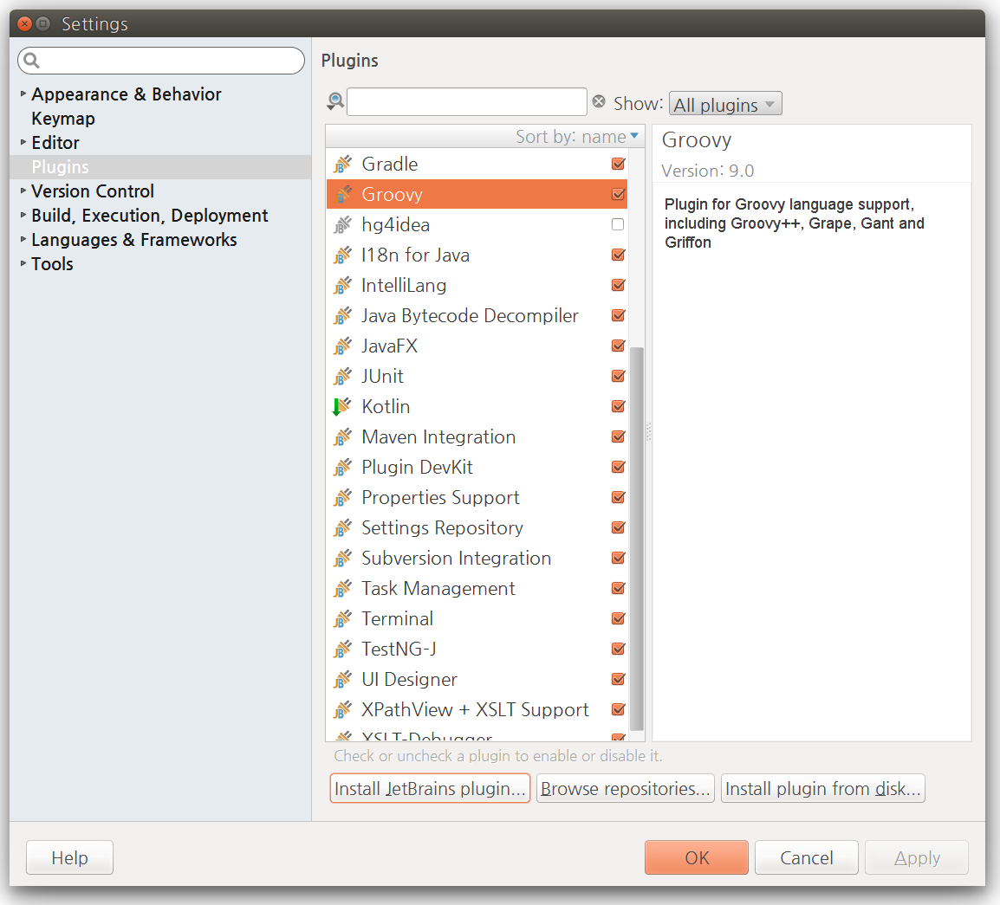

## Java 프로젝트에 Groovy를 섞어 쓰는 설정

### Maven
`/src/main/java` 아래에 `.groovy` 파일을 놓아도 컴파일을 할 수 있는 설정입니다.

`<dependencies/>` 태그의 하위 요소로 groovy에 대한 의존성을 추가합니다.

```xml
<dependency>
	<groupId>org.codehaus.groovy</groupId>
	<artifactId>groovy</artifactId>
	<version>2.4.7</version>
</dependency>
```

`<build-plugins/>`  태그의 하위 요소로 `<maven-compiler-plugin/>`에 대한 선언을 아래와 같이 추가합니다.

```xml
<plugin>
	<groupId>org.apache.maven.plugins</groupId>
	<artifactId>maven-compiler-plugin</artifactId>
	<configuration>
		<source>1.8</source>
		<target>1.8</target>
		<compilerId>groovy-eclipse-compiler</compilerId>
		<meminitial>128m</meminitial>
		<maxmem>512m</maxmem>
		<encoding>utf-8</encoding>
		<fork>true</fork>
	</configuration>
	<dependencies>
		<dependency>
			<groupId>org.codehaus.groovy</groupId>
			<artifactId>groovy-eclipse-compiler</artifactId>
			<version>2.9.1-01</version>
		</dependency>
		<dependency>
			<groupId>org.codehaus.groovy</groupId>
			<artifactId>groovy-eclipse-batch</artifactId>
			<version>2.3.7-01</version>
		</dependency>
	</dependencies>
</plugin>
```

참고로 groovy-eclipse-compiler 2.7.x대의 버전을 쓸때는 `groovy-eclipse-batch`에 대한 의존성을 따로 추가하지 않아도 됩니다.

### Gradle
`/src/main/java` 아래에 `.groovy` 파일을 놓아도 컴파일을 할 수 있는 설정입니다.

```groovy
apply plugin: 'java'
apply plugin: 'groovy'

[compileGroovy, compileTestGroovy]*.options*.encoding = 'UTF-8'

compileJava {
	sourceCompatibility = 1.8
	targetCompatibility = 1.8
}

compileJava {
	dependsOn compileGroovy
}

sourceSets {
	main {
		groovy {
			srcDirs = ['src/main/java']
		}
		java {
			srcDirs = []
		}
	}
}

tasks.withType(GroovyCompile) {
	dependsOn = []
}

tasks.withType(JavaCompile) { task ->
	dependsOn task.name.replace("Java", "Groovy")
}

```

### Eclipse

#### (권장) 방법1 : Update site 주소 이용
1. `[Help] > [Install New Software ...]` 메뉴로 이동.
2. 플러그인 업데이트 사이트(Update site)의 주소를 'Work With’란에 입력한 후 `Add` 버튼을 누른다.
	- Eclipse 4.6 (Neon) : http://dist.springsource.org/snapshot/GRECLIPSE/e4.6/
	- Eclipse 4.5 (Mars) : http://dist.springsource.org/snapshot/GRECLIPSE/e4.5/
	- Eclipse 4.4 (Luna) : http://dist.springsource.org/release/GRECLIPSE/e4.4/
	- Eclipse 4.3 (Kepler) : http://dist.springsource.org/release/GRECLIPSE/e4.3/
	- Eclipse 4.2 (Juno) : http://dist.springsource.org/release/GRECLIPSE/e4.2/
	- Eclipse 3.7 (Indigo) : http://dist.springsource.org/release/GRECLIPSE/e3.7/
	- Eclipse 3.6 (Helios) : http://dist.springsource.org/release/GRECLIPSE/e3.6/
3. 아래 2개의 Plugin을 선택
	- Groovy Eclipse
	- m2e Configurator for Groovy-Eclipse



설치가 끝난 후에도 pom.xml에 빨간 줄이 남아 있다면 아래 동작을 수행하다.

- 프로젝트명에서 우클릭 `> [Maven] > [Disable Maven Nature]`
- 프로젝트명에서 우클릭 `> [Configure] > [Convert to Maven Project]`

#### 방법2 : STS(SpringSource Tools Suite)의 Extension 기능으로 설치
STS를 쓰고 있다면 사용할 수 있는 방법입니다. 그러나 이 방법은 STS 3.8.3 (Eclipse 4.6 기반)에서는 잘 동작하지 않습니다.

1. `[Help] > [Dashboard]`메뉴로  이동
2. `[Extensions]` 탭 선택
3. `Find:`란에 groovy를 입력
4. 아래 2가지 plugin을 선택해서 설치합니다.
	- Groovy-Eclipse
	- Groovy-Eclipse Configurator for M2Eclipse

이미 설치된 Plugin이 있을지도 모르므로 'Show installed' 옵션을 켜고 확인을 하는 것이 좋습니다.



#### 방법3 : `pom.xml`에서 Quick fix
pom.xml에 `maven-compiler-plugin`빨간 줄이 뜨면 Ctrl +1 을 누른 후 안내에 따라 플러그인을 찾아서 설치합니다.

이 방법도 STS 3.8.3 (Eclipse 4.6 기반)에서는 잘 동작하지 않습니다.

### IntelliJ
JetBrains의 Groovy plugin은  IDEA community Edition에서도 사용할 수 있습니다.

'File > Settings'(단축키 Ctrl + Alt + S) 로 이동해서 Plugin 메뉴를 클립합니다. Groovy Plugin이 보인다면 선택합니다.



없다면 `[Install JetBrains plugins...]`를 클릭합니다.  Groovy로 검색해서 설치합니다.

참고로 pom.xml에  `groovy-eclipse-compiler`에 대한 선언이 있어도 IntelliJ에서는 이를 잘 지원합니다.

